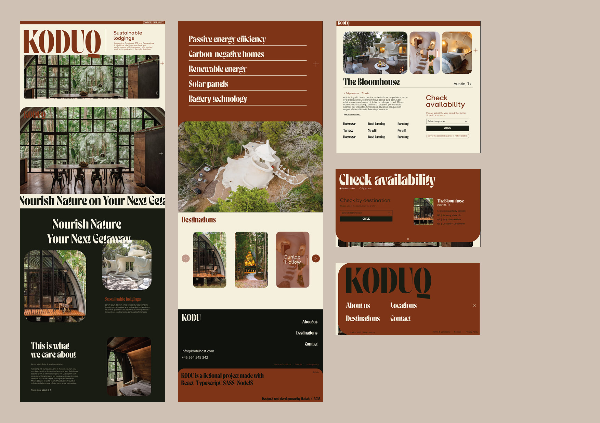

# KODUQ
! [work in progress]

Koduq is a Front-end web application that simulates a platform that offers long-term retreats in sustainable homes, ensuring guests have a zero environmental footprint during their stay.

### Technologies & libs
- TypeScript
- React
- SASS
- GSAP
- React Router
- Vite 

### Methodologies & architectures: 
- Component-first
- Design System implementation
- Atomic Design
- BEM
- ITCSS
- DDD for bussiness logic

---
<!--  -->

### Description & goals

In this project, my focus has been on implementing  a **Design System** I initially conceptualized on Figma. The main goal was to be able to traslate this visual system into code, ensuring consistent theming, **component modularity** and scalability. 

The styles were crafted with SCSS inspired by methodologies and architectures such as **BEM**, **Atomic Design** or **ITCSS**. I didn't want to be strictly tied to them, but to use them to my own advantage and according to the needs of my system.

Throughout the project, I've aimed to retain the integrity of the original design, optimizing for **performance**, **responsiveness**, and **user experience**. I also implemented several animations using the GSAP library.

